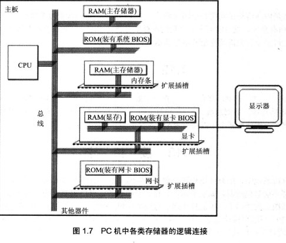

## Chapter 01 汇编语言基础

> 汇编语言直接工作在硬件之上

- 指令和数据本质上都是二进制信息

- 存储单元对应**一个字节**，微机存储器的存储容量是**以字节为最小单位来进行计算的**

  - 微机存储器的存储单元可以存储一个Byte，即8个二进制位

- CPU

  - 数据总线

    - **数据总线传送的是bit**，例如8086的数据总线宽度为16，则对应可以一次性传送16bit（2Bytes)

  - 地址总线

    - 要注意的是寻址能力指的是**用一个数字表示一个字节存储单元的地址，而不是表示这个存储单元中的内容**，寻址能力，均是以字节为单元的，而**不是以bit为单元**。

  - 控制总线

- 各类存储器芯片
  - 随机存储器（RAM）
  - 装有BIOS（基本输入输出系统）的只读存储器（ROM）
  - 接口卡上的RAM
  - 逻辑链接示意图

  

- 内存地址空间（各类存储器看作为一个逻辑存储器）
  - 内存地址空间的大小受CPU地址总线宽度的限制（8086 地址总线宽度为20，则为1MB的内存地址空间的大小）
  - 8086PC机的存储地址分配情况
    - RAM	
    - 显存			
    - 各类ROM地址空间

