## 数值转换部分

### 浮点数的相关表示

- 分类（小数点位置是否固定）

  - 浮点数

    - > ```
      > 以适当的形式将比例因子表示在数据中，让小数点的位置根据需要而浮动。
      > ```
      >
      >
      > ```
      > 我们计算机的容量有限，不可能对每个数都用特别多的位数来表示，比如说$2×10^{99}$，这种非常大的数不可能用定点数来表示，所以利用浮点数就可以在位数有限的情况下扩大数的表示范围，同时能保持一定的有效精度
      > ```
      >
      >
    - 表示方法：

      $$
      N = r^E \times M

      $$
    - 通常式子里面r是浮点数阶码的底，在计算机中是隐含的，通常情况下r=2。**E和M都是带符号的定点数**，E叫做阶码，M叫做尾数。其中E的大小越大，能表示的数范围越大，M的位数越大，数的有效精度越高。

    > 举例说明
    >
    > 简单地举一个例子，1.111×2^100 这里面1.111就是尾数，**100就是阶码，显然这里阶码占的位数为3位，尾数占的位数是4位**.
    >
    > 假如阶码占的位数有4位，位数占的位数是3位（阶码和尾数所占位数总和不变），那么这个数就只能表示为1.11×2^0100，显然能表示的数的范围变大了，就这个例子来说原来尾数1.111转变为1.11损失了0.001，这就是精度的损失
    >

    - 浮点数的一般格式如下:
    - J是阶符，表示阶码的符号，S是数符，表示浮点数的符号，阶符J和阶码的m位合起来表示浮点数的表示范围和小数点的实际位置，n位尾数反映了浮点数的精度
  - 定点数

### 二进制的表示形式

#### 机器数和真值

- 机器数就是数值在计算机中的二进制表示，数值有正负之分，因此机器数用最高位来表示数值的符号，0 代表正数，1 代表负数。
  - 根据表示方法不同，机器数分为：原码、反码、补码、移码等。
- 真值就是**带正负**的真实十进制值。
  - 符号位 + 其他位

#### 原码、反码和补码的相关概念

- 补码的作用：使用二进制的形式表示负数（有符号常量）
- 原码:**最高位作为符号位**，其余位表示真值的绝对值

##### 反码

**正数**的反码就是 **其原码本身** ，**负数**的反码则是 ***原码除符号位外*** ，其余位取反。

反码的运算方法为 **循环进位**，即 最高位的进位要加到最低位来。如：`8位为例：11111110(-1) + 11111110(-1) = 11111100 + 1 = 11111101(-2)`

**产生的原因**： 计算机的所有计算本质上都是加法，然而若正负值相加时让计算机判断符号位来选择运算方式会使得加法电路设计变得复杂，但是若直接让符号位参与运算则会带来 `1 + (-1) = -2 （8位为例：00000001 + 10000001 = 10000010）` 等等问题。反码的提出就是为了解决 **符号位参与运算** 的加法问题。

##### 补码

反码是一个不完美的解决方案，有不近人意的问题。比如: `8位为例，00000000 和 11111111` 都可以表示零，一个 `+0`，一个 `-0`。为了解决这个问题，引入补码来表示数值。

**正数** 的补码是 **其原码本身** ，**负数** 的补码是 **其反码 + 1** 。这个设计使得加法运算满足一个等式：`a(补) + b(补) = (a + b)(补)` ，由此，不管符号为何，直接参与运算都能得到正确的结果。**目前补码是最佳的解决方案。** ***现行的编程语言，都是用补码来表示数值和进行算数运算***

补码的表示方法：正数的补码就是其本身，负数的补码表示为符号位不变，其余各位取反加一（即在反码的基础上加一）

## 微处理器部分

### 处理器的代表型号

- `Intel 4004` 世界第一个商用微处理器
- `Intel 8008` 世界上第一款八位微处理器
  - `8080`第二代微处理器
- `Intel 8086` 第一个16位的微处理器
  - `Intel 80286`也是Intel最后一块16位CPU
- `Intel 8088`从8088开始，个人电脑(PC)的概念开始在全世界范围内发展起来。
- `80386`使32位CPU成为了PC工业的标准(i386)

### 计算机体系结构

##### 冯诺依曼

> 受众：
>
> - Intel x86体系结构
> - ARM 7以前早期的ARM架构

- 特点

  - 计算机硬件由运算器、控制器、存储器、输入设备和输出设备五大部分组成
  - **数据与指令存储在单一的读写存储器中**

    - > **程序指令存储地址和数据存储地址指向同一个存储器的不同物理位置，因此程序指令和数据的宽度相同**
      >
  - 存储器的内容通过位置寻址，而不考虑它容纳的数据是什么；
  - 以顺序的形式从一条指令到下一条指令来执行（跳转指令除外）。
- 对冯·诺依曼结构处理器由于取指令和存取数据需要从同一存储空间存取，经由同一总线传输，因而它们无法重叠执行，只有一个完成后再进行下一个

##### 哈佛结构

> 受众:
>
> - 51单片机
> - ARM结构

- 并行体系结构
- 将程序和数据存储在不同的存储空间中，每个存储器独立编址、独立访问
  - 总线也是独立的

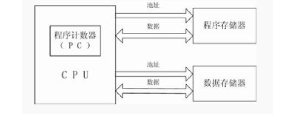

##### 改进型哈佛结构

- 仍然使用两个独立的存储器模块
- 改进型哈佛结构具有一条独立的地址总线和一条独立的数据总线，利用公用地址总线访问两个存储模块（程序存储模块和数据存储模块）
  - **总线分时复用**
- **体系结构与采用的独立与否的总线无关，与指令空间和数据空间的分开独立与否有关**

#### 计算机系统层次结构

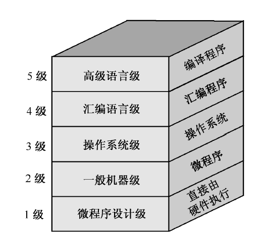

### 微处理器的系统结构

#### 微处理器的分类

- 通用型微处理器
  - CPU
- 嵌入式微处理器
  - 单片机
  - ARM
  - 嵌入式DSP处理器

> 微处理器指令形式的分类
>
> - 复杂指令集（CISC）
> - 嵌入式精简指令集（RISC）**嵌入式微处理器**常用

### CPU简介

#### CPU功能（简述）

> 区分8086的相关功能

- 指令顺序控制
- 操作控制
- 时间控制
- 数据加工

#### CPU的内核结构

- 运算部件（算逻单元，ALU）
- 寄存器组

  - 指令寄存器（IR）
  - 地址寄存器（AR）
  - 数据寄存器（DR）
  - 累加寄存器（AC）
  - 状态条件寄存器（Flag）
  - 程序计数器（PC）
    - 指令计数器，指出下一条要执行的指令在存储器中的地址，**但是遇到JMP指令事，后续指令地址必须从指令寄存器中的地址字段取得**
- 指令译码（ID）
- 控制电路（controller）
- 高速缓存器（Cache）

### CPU设计体系结构

> CPU的指令执行流程:
>
> - 取指令
> - 指令译码
> - 指令执行
> - 结果写回

##### 8086 & 单片机 & ARM的分类

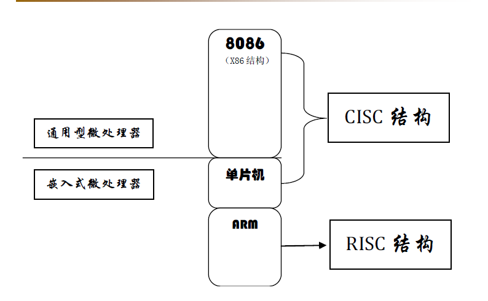

- CISC的结构特点**（通用性好，复杂）**
  - 指令长短不一
  - 指令集过大
  - 微指令译码结构
    - 机器指令读入CPU内后，经过译码单元将一条复杂的x86指令译码为多个微指令代码，再送到CPU执行单元进行操作（把代码“揉碎”）
  - 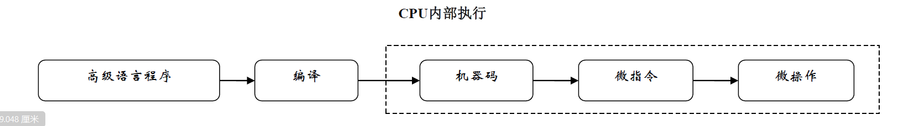
  - 软件功能硬件化
  - 优化目标程序
  - **CPU指令集向下兼容性好；CISC指令系统过于复杂，指令规模过于庞大**
- RISC的结构特点**（快、需要优化）**
  - 最大特点是指令长度固定，
  - 指令格式种类少，寻址方式种类少，
  - 大多数是简单指令，并且都能在一个时钟周期内完成。
  - RISC 易于设计超标量与流水线，寄存器数量多，大量操作在寄存器之间进行
  - RISC 必须经过编译程序的处理，才能发挥它的效率
  - **大多数指令在一个时钟周期内完成；采用装载—存储（Load/Store）结构**
  - 指令简单、**硬布线控制逻辑**

#### 微处理器的体系结构

- 随机逻辑（硬连）体系结构（RISC构架）
- 微码体系结构（CISC构架）
- 流水线体系结构
- 超流水线体系结构
- 超标量体系结构
- 片上多核处理器

### 8086微处理器系统结构

#### 8086 CPU

##### 8086 CPU结构

- 16位微处理器
- 外部数据总线：16；地址线：20（可寻址1MB）
- 并行流水线结构
- 内部结构划分

  - 控制器
  - 运算器
  - 寄存器
- 另一种结构划分方式

  - BIU：总线接口部件 Bus Interface Unit
    - 4个16位段地址寄存器
    - 16位指令指针IP，由BIU自动修改
    - 20位物理地址加法器
    - 6字节指令队列
    - 总线控制逻辑
  - EU：执行部件Execution Unit
    - ALU
    - FR（Flag）
    - 通用寄存器（AX：**累加器**）
    - EU控制器

##### 8086 CPU寄存器介绍

- 总关系简介

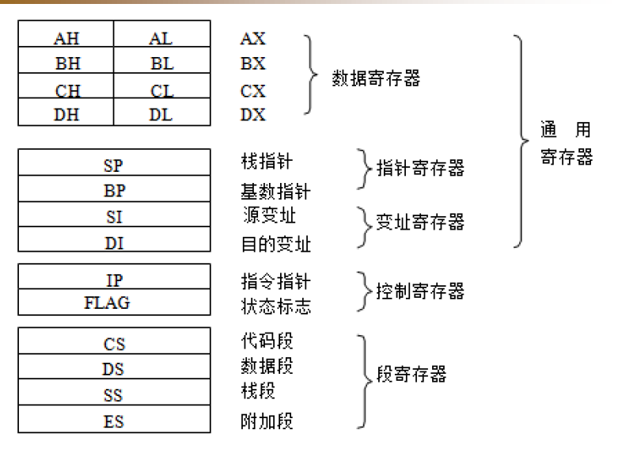

- 通用寄存器
  - 数据寄存器（AX-DX，只能存放数据）
  - 地址指针和变址寄存器（**偏移地址**）
    - SP（当前堆栈段中栈顶的偏移地址）
    - BP（访问堆栈的基址寄存器）
    - SI、DI（Source、Destination）

##### 物理地址的合成和段超越现象

> 合成举例：CS[IP]、SS[SP]；使用段地址 + 偏移地址的合成方法

- 存取数据操作，是将当前数据段寄存器DS中的段基址左移4位，再与16位偏移地址EA相加，形成20位的物理地址；
- 对于压栈和弹栈操作，是将当前堆栈段寄存器SS中的段基址左移4位，再与SP相加，形成20位的物理地址；
- 在对目的串操作时，是以当前附加段寄存器ES中的段基址左移4位，再与DI相加以形成20位的物理地址。
- 基本段约定和允许的段超越

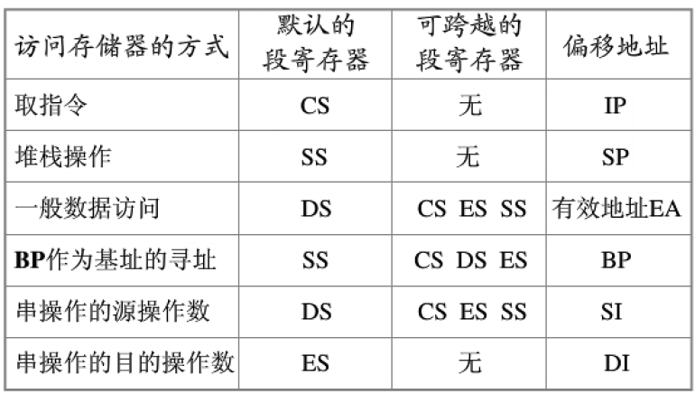

##### 8086引脚&功能

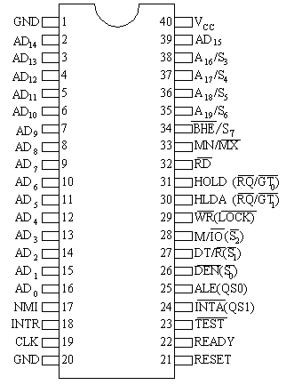

- 34 BHE（注意低电平有效）
  - **结合$A_0$（地址总线最低位）实现对不同存储体的选择：奇地址&偶地址**
- 30 31总线控制信号
- **33 MN 工作模式选择**

##### 时钟与指令周期

- 指令周期一般分为：**取指周期、取操作数周期和执行周期**三个部分
- 8086 CPU由外部的一片8284芯片提供主频为5MHZ的时钟信号
- 8086cpu对奇数内存写需要两个总线周期，对偶数地址用一个周期

##### 8086的工作模式

- 最大工作模式：多处理机系统

  - 在最大工作模式下，系统所需要的控制信号均由总线控制器8288提供
- 最小工作模式：单机系统

  - 系统中所有总线控制信号全部由8086直接提供
- 8086具体工作在最大模式还是最小模式，完全由硬件连接决定

  - MN
    - 高 最小
    - 低 最大

##### 8086最小模式系统（区别后面的单片机最小系统）

> 8086（控制）、8282（地址）、8286（数据）、Memory 、I/O、时钟

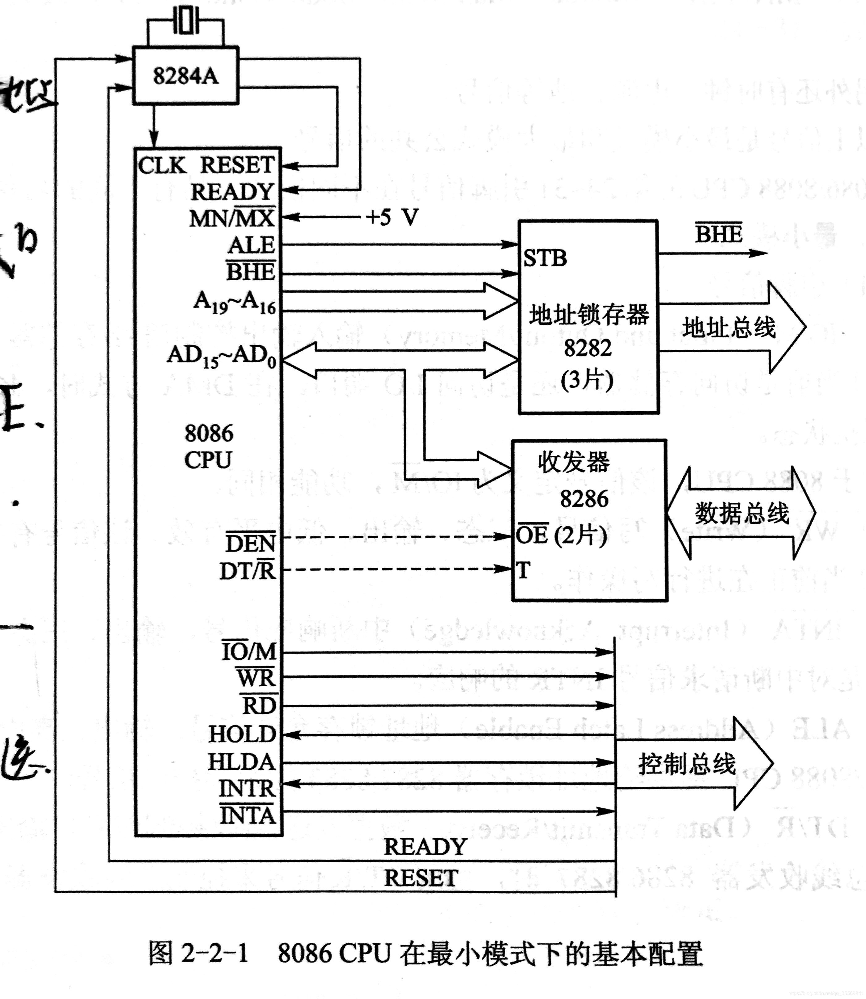

- 8086CPU（控制）、存储器、I/O接口芯片
- 时钟发生器
- 地址锁存器（地址总线）
- 双向数据总线发生器（数据总线）

##### 8086 CPU总线操作与时序

- 8086 CPU的操作可分为内操作与外操作两种

  - 内操作是CPU内部执行指令的过程
  - 外操作是CPU与外部进行信息交换的过程
  - 外部操作主要指的是总线操作
- 基本总线周期

  - 由4个时钟周期组成，分别用T1、T2、T3、T4表示，称为T1、T2、T3、T4状态
  - T1状态，CPU输出地址信号，T2、T3、T4状态传送数据
    - 如果在T2、T3、T4状态无法完成数据传送，就在T3与T4状态之间插入Tw

#### 8086存储器

##### 分类

- 内部存储
- 外部存储

##### 物理地址

物理地址 = 段基址*16 + 偏移地址

##### 存储器分体结构

> CPU有16根数据线，而存储器一个基本单元（字节）有8根数据线，因此通常将存储系统分为偶体存储器和奇体存储器与8086相连的方法

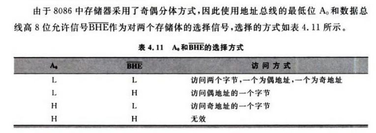

- 偶体存储器（A0选择）

  - 一个存储体包含全部偶数地址的单元
  - 偶地址单元的数据在**数据线低8位**上传输
- 奇体存储器（$\rm{BHE}$**非** 选择）

  - 一个存储体包含全部奇数地址的单元
  - 奇地址单元的数据在**高8位数据线**上传输
- **一个字在存储器中按相邻两个字节存放，存入时以低位字节在低地址，高位字节在高地址的次序存放**，**字单元的地址以低位地址表示**

> 8086 CPU访问存储器时，都是以字为单位进行的，并从偶地址开始。
>
> 当CPU读/写一个字时，如果字单元地址从偶地址开始，那么只需要访问一次存储器，低位字节在偶地址单元，高位字节在奇地址单元。
>
> 如果字单元地址从奇地址开始，那么CPU需要两次访问存储器，第一次取奇地址上数据（忽略偶地址的8位数据），第一次取偶地址上数据（忽略奇地址的8位数据）。
>
> 因此为了加快程序运行速度，编程时注意从存储器偶地址开始存放字数据

##### 栈

- **主要用于暂存数据和过程调用或处理中断时暂存断点信息**
- 存储区的一端固定，另一端活动，**先进后出**
- 栈段是由段定义的一个段，它可以在存储器1MB空间内任意浮动，**但容量小于等于64KB**
- 栈段中存储单元的地址由寄存器SS和SP确定
- 8086的堆栈的伸展方向是从大地址向小地址
- **栈操作以字为单位进行，而栈中的数据必须按规则字存放**

  - 低字节在偶地址单元，高字节在奇地址单元

##### 存储器与I/O结构

- 8086最小模式中的存储器选择（8282 + 8286）

  - $A_0、BHE非$实现奇偶体选择
  - $A_1-A_{19}$实现地址选择，一般地址总线宽度决定了寻址能力（内存大小）
    - 例如$A_0 - A_{10}$一共可以确定$2^{10}=1\rm{K}$内存（HEX：000H-3FFH）
  - 8286数据总线 决定位宽
- 通过地址译码实现片选的方式

  - 线性选择法
  - **全译码选择法**

  > 全译码选择法是指将地址总线中除片内地址以外的全部高位地址接到译码器的输入端参与译码。采用全译码法，每个存储单元的地址都是唯一的，不存在地址重叠，但译码电路较复杂，连线也较多
  >

  - 部分译码法
- 芯片扩展方式

  > 涉及到$AD_0-AD_{15}$地址数据复用总线（双向、三态）
  >

  - 位扩展：增加存储字长，指增加存储字长。位扩展可以利用芯片地址并联的方式实现

  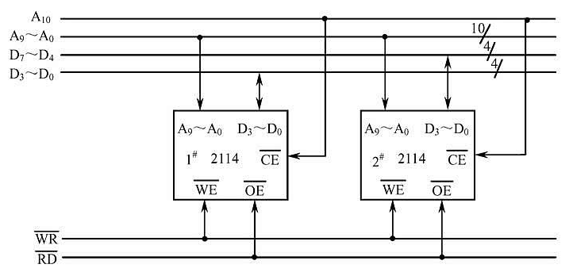

  - 字扩展：增加容量，字扩展是指增加存储器字的数量，字扩展可利用芯片地址串联的方式实现

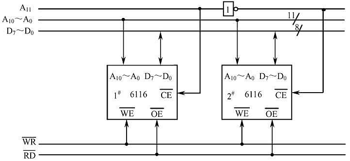
